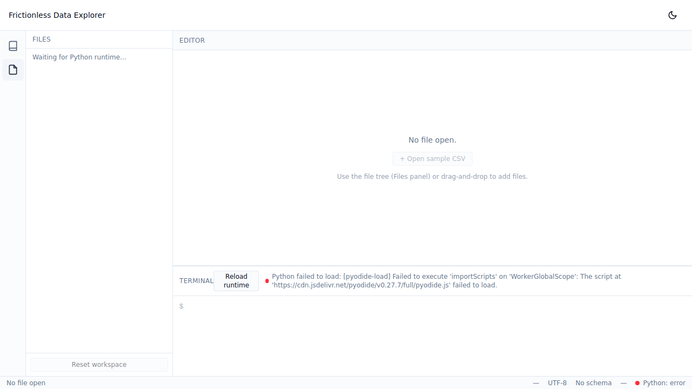

# tabular-data-playground

An in-browser playground for [Frictionless](https://frictionlessdata.io/)
data — a research artefact built to evaluate Frictionless against a
real curriculum, end-to-end, with no servers and no accounts.

The deployed playground gives you a Monaco editor, a virtual
filesystem, and a small shell wired to Pyodide so the
`frictionless` CLI runs entirely in the browser. Eight short
lessons walk through the toolchain (`describe`, `validate`,
schemas, packages, dialects, transform, inquiry, publish &
consume) and each lesson carries a **Notes & Observations**
section capturing what worked, what surprised, and what required
workarounds while authoring. Those notes are the evaluation
output; this README distils them.

**Live**: https://deepbluecltd.github.io/tabular-data-playground/ — a
welcome page linking to:

- the **IDE** at
  [`/playground/`](https://deepbluecltd.github.io/tabular-data-playground/playground/)
- the **findings slides** at
  [`/slides/`](https://deepbluecltd.github.io/tabular-data-playground/slides/)
  — a short deck distilling the evaluation (source in `web/slides/`).



## Findings

Running the eight lessons end-to-end against `frictionless==5.19.0`
on Pyodide `0.27.7`, the headline findings are:

- **The core describe → validate → schema-author loop is
  boring-good.** Type inference is fast and reasonable, the
  validate report is specific (row, field, constraint), and the
  edit-then-revalidate cycle is satisfying. The healthy 80% of
  the tool.
- **`validate` without a schema returns VALID even on garbage
  semantic data** — the most important footgun. Lesson 3
  promotes this to a top-level callout: in production, always
  pair `validate` with an explicit schema. The default mode is a
  parser check, not a correctness check.
- **`primaryKey` and field-level `unique` emit two distinct
  errors on the same duplicate row.** Useful to know before
  reading a report literally and over-counting problems.
- **Inquiries are stricter than packages on the same schema.**
  `"primaryKey": "id"` (string form) is fine in a package but
  rejected inside an inquiry-embedded schema; schema-by-path
  references work in package contexts but fail inside inquiry
  tasks. Two real foot-stubs surfaced in lesson 7.
- **`9,50` is inferred as a `geopoint`** (lesson 5). Type
  inference has cultural priors: a European decimal-comma price
  reads as a coordinate pair. Override with a schema and
  `decimalChar: ","` is the working pattern.
- **The v5 CLI does not expose `transform`** (lesson 6). The
  most-mentioned Frictionless verb is the only one without a
  CLI; you drop into the Python `transform` function. The lesson
  uses `python run-pipeline.py` against a JSON pipeline
  descriptor. This is the most version-fragile lesson — pin
  Frictionless and re-walk it on any upgrade.
- **`row-filter` formulas operate on raw string values.** Naïve
  `published_year >= 1970` raises TypeError; the working form is
  `int(published_year) >= 1970`. Specific to v5.19's transform
  surface.
- **Step naming is inconsistent across the transform family.**
  `field-remove` takes `names` (plural list); other steps take
  `name` (singular). Easy to miss when authoring pipelines fast.
- **Remote consumption of a Data Package "just works"**
  (lesson 8). `frictionless describe <URL>` and
  `frictionless validate <URL>` follow relative paths inside the
  package and validate across CSVs hosted at the same URL prefix.
  This is the closing-the-loop moment of the whole curriculum.

The full Notes & Observations are in
`content/lessons/{01..08}/lesson.md`. Sharp edges and version
risks are catalogued in `docs/limitations.md`.

## Pinned versions (v1.0 freeze)

The deployed playground is a research artefact: pinned and frozen
on purpose (Constitution Principle VI). The pins are the contract
the lessons in `content/lessons/` were authored against.

| Component | Version | Source |
|-----------|---------|--------|
| Pyodide | `0.27.7` | `app/src/pyodide/config.ts` (`PYODIDE_VERSION`); served from `https://cdn.jsdelivr.net/pyodide/v0.27.7/full/`. |
| Frictionless | `5.19.0` | `app/src/pyodide/config.ts` (`FRICTIONLESS_VERSION`); installed at runtime via `micropip.install("frictionless==5.19.0")` in the Pyodide worker. |
| Livemark | `0.110.8` | `app/src/pyodide/config.ts` (`LIVEMARK_VERSION`); lazily installed (server stack stubbed) on first `livemark` command — see lesson 9 and `docs/limitations.md`. |
| marko | `1.3.1` | `app/src/pyodide/config.ts` (`MARKO_VERSION`); installed before frictionless so `frictionless` (`marko>=1.0`) and `livemark` (`marko==1.*`) can coexist. |
| Data Package JSON Schema | snapshot 2026-05-09 | Bundled from `https://specs.frictionlessdata.io/schemas/data-package.json` to `app/src/editor/schemas/data-package.json`. |
| Table Schema JSON Schema | snapshot 2026-05-09 | Bundled from `https://specs.frictionlessdata.io/schemas/table-schema.json` to `app/src/editor/schemas/table-schema.json`. |
| Table Dialect JSON Schema | snapshot 2026-05-09 (v2) | Bundled from `https://datapackage.org/profiles/2.0/tabledialect.json` to `app/src/editor/schemas/table-dialect.json` (`specs.frictionlessdata.io` returns 404 for dialect; `datapackage.org` is the canonical home). |
| reveal.js (findings slides) | `5.1.0` | Loaded by `web/slides/index.html` from `https://cdn.jsdelivr.net/npm/reveal.js@5.1.0/` — the URL is the pin. |

The editor still attempts a runtime fetch of the canonical schemas
on mount with a short timeout and uses the live copy if it
arrives; the bundled snapshots are the offline / outage fallback.
JavaScript dependencies are pinned via `pnpm-lock.yaml`; CI uses
`--frozen-lockfile`. The Monaco editor assets load from jsdelivr
at a pinned `monaco-editor@<version>` URL — the URL is the pin.

**Do not bump pins without re-walking lesson 6** (Transform), the
most version-fragile lesson in the curriculum.

## Setup / development

The app lives under `app/` (a `pnpm`-managed Vite + React +
TypeScript project).

```bash
cd app
pnpm install --frozen-lockfile
pnpm dev                     # local dev server (Vite)
pnpm build                   # tsc --noEmit && vite build
pnpm typecheck               # tsc --noEmit
pnpm lint                    # eslint
pnpm test:e2e                # Playwright Chromium smoke
pnpm capture:screenshots     # regenerate app/e2e/screenshots/
```

The static welcome page and findings slides live in `web/`
(`web/index.html` and `web/slides/`); the IDE lives in `app/`. The
deploy workflow assembles all three into the published gh-pages tree.

CI runs `pnpm build` and `pnpm test` on PR (`.github/workflows/`), and
deploys to GitHub Pages on push to `main`. Each PR also gets a full-site
preview published under `pr-preview/pr-<N>/` of the `gh-pages` branch,
with a sticky comment linking to it; the preview is removed when the PR
closes.

## Further reading

- [`spec.md`](./spec.md) — the product specification (v0.5).
- [`.specify/memory/constitution.md`](./.specify/memory/constitution.md)
  — non-negotiable principles and per-feature gates.
- [GitHub Project board](https://github.com/orgs/DeepBlueCLtd/projects/5)
  — current work tracker (see
  `docs/migration/to-project-board.md` for the cutover from the
  previous `backlog.md` file).
- [`docs/history/backlog.md.archived`](./docs/history/backlog.md.archived)
  — the historical pre-v1.0 backlog, all items complete at v1.0.
- [`docs/architecture.md`](./docs/architecture.md) — runtime
  architecture and Phase 0 measurement results.
- [`docs/limitations.md`](./docs/limitations.md) — every sharp
  edge that mattered enough to record (Principle VII).
- [`docs/lesson-authoring.md`](./docs/lesson-authoring.md) —
  how to write a new lesson.
- [`content/lessons/`](./content/lessons/) — the eight v1
  lessons; each carries its own Notes & Observations.
